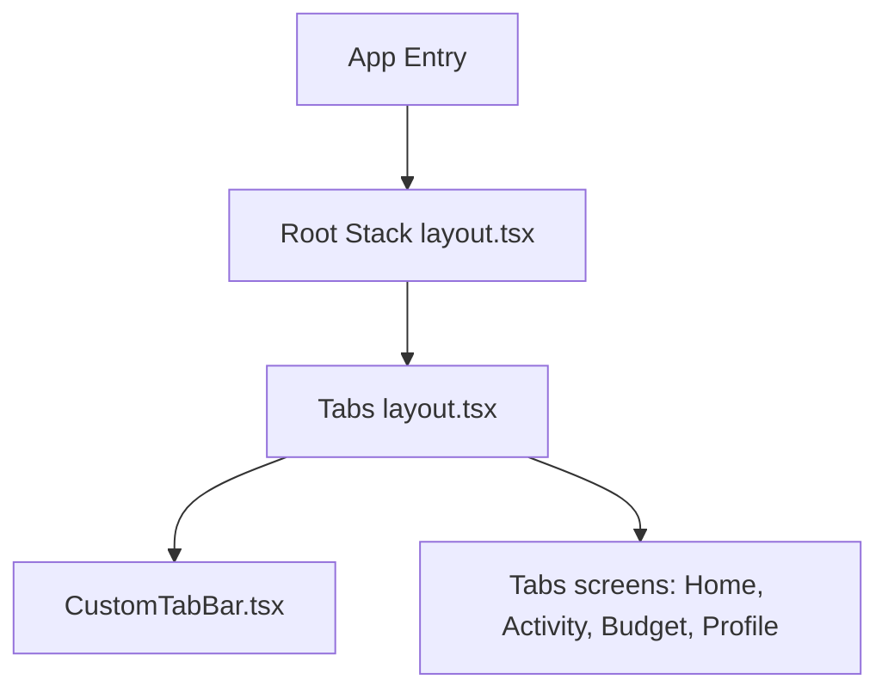

# Architecture Documentation

This document describes the high-level architecture of `WhereCash`, a modern, polished personal finance application built using Expo, React Native, and TypeScript.

---

## 1. Directory Structure

The project follows a standard modular organization:

- **`src/app/`**: routing tree managed by Expo Router.
  - `_layout.tsx`: Root application container configuring global providers (`GestureHandlerRootView`, font preloading, status bar styling).
  - `(tabs)/_layout.tsx`: Tabs layout using Expo Router `<Tabs>` and mapping routes to screens using our animated floating custom tab bar.
  - `(tabs)/index.tsx`, `budget.tsx`, `profile.tsx`, `transactions.tsx`: Screen components.
- **`src/components/`**: Reusable UI components.
  - `CustomTabBar.tsx`: Custom bottom navigation bar incorporating sliding spring indicators, micro-interactions, haptic feedback, and platform safe-area contexts.
  - `GlassCard.tsx`, `CustomButton.tsx`, `AppText.tsx`: Core UI elements styled to match the theme.
- **`src/store/`**: Global state management powered by Zustand.
  - `themeStore.ts`: Tracks active theme mode (`light` or `dark`).
  - `authStore.ts`: Simple user authentication and initialization mock.
- **`src/hooks/`**: Custom React hooks.
  - `useTheme.ts`: Helper interface resolving colors and toggle methods.
  - `useCachedFonts.ts`: Asynchronously preloads Google Fonts (`Poppins`, `Inter`).
- **`src/constants/`**: Colors, dimensions, typography scale configurations.

---

## 2. Navigation Architecture

`WhereCash` employs file-based routing:
1. **Root Stack**: Standard stack navigator transitioning between screens (header hidden). The first route is `(tabs)`.
2. **Bottom Tabs**: Replaces standard bottom tab bar with an animated custom component (`CustomTabBar`).

### Custom CustomTabBar Integration
Instead of rendering static tabs, the layout renders `CustomTabBar` which fetches safe area insets via `react-native-safe-area-context` to dynamically position itself at the bottom of the screen.

---

## 3. Component Details & Interactions

### CustomTabBar (`src/components/CustomTabBar.tsx`)
- **Glassmorphic Layout**: Blurs screen content on iOS using `expo-blur`. Fallback semi-transparent backgrounds are applied on Android.
- **Micro-Interactions**:
  - Unfocused tabs show only their respective icons.
  - Selecting a tab triggers a scale increase on the icon (`1.12x`), shifts it upward (`translateY: -8px`), and spring-fades its text label (`opacity: 1`, `translateY: 0`) from below.
- **High-Performance Animations**: Powered by `react-native-reanimated` running transitions directly on the native thread.
  - Horizontal translation of the active indicator uses `withSpring`.
- **Haptics**: Triggers selection feedback via `expo-haptics` to reassure user interactions.

### GlassCard (`src/components/GlassCard.tsx`)
- **Liquid Glassmorphic System**: Employs frosted glassmorphism across both themes (frosted white `tint="light"` in light mode, frosted black `tint="dark"` in dark mode).
- **Refraction Gradients**: Combines `BlurView` with dynamic, subtle linear gradients overlaid underneath to simulate natural glass refraction.
- **Top Shine Line**: Adds a 1px solid white reflection highlight bar with high opacity at the upper edge to resemble thick, polished sheet glass.
- **Deep Shadows**: Implements multi-level, low-opacity drop shadows (`shadowRadius` up to 16) to give the illusion of elevation and tangible physical depth.

### CategoryIcon (`src/components/CategoryIcon.tsx`)
- **Professional Iconography**: Standardized on high-quality vector outline icons from `@expo/vector-icons/Ionicons` instead of generic platform emojis.
- **Frosted Badges**: Each icon is centered inside a micro-bordered glassmorphic square container styled with a matching low-opacity background (18% opacity) and a thin translucent border matching the category's theme color.

### ProgressRing (`src/components/ProgressRing.tsx`)
- **Center Vector Badge**: Renders category-specific vector icons centered within the SVG circle, styled inside a micro circular liquid-glassmorphic badge (translucent backdrop, border, and custom-colored drop shadow glow).
- **Utilization Colors**: Dynamically adapts the stroke color based on utilization percentages or custom theme overrides.

### Budget Monthly Overview Card (`src/app/(tabs)/budget.tsx`)
- **Interactive State-Based Iconography**: Integrates an `AnimatedIcon` that changes based on budget utilization (normal `wallet`, warning `trending-up` at 85%, and red `alert-circle` over-budget). The alert icon loops a scale pulse animation to draw attention.
- **Worklet-Driven Spring Animations**: Offloads animations (progress bar filling and entrance layout transitions) to Reanimated worklets on the native UI thread, achieving smooth 60 FPS performance.
- **Staggered Entrances**: Staggers entrance animations for the Overview card, Progress Rings, and Planned Payments timeline to create a premium, polished dashboard transition.

---

## 4. Global State & Theme Integration

- Theme values (`LightTheme` and `DarkTheme` from `src/constants/themes.ts`) are hooked dynamically in UI components using the `useTheme` interface.
- Changing theme mode automatically triggers color updates within the custom tab bar (dynamic transition from lime neon indicators on light theme to soft glassmorphic indigo indicators on dark theme).

## 5. Multi-Layer Refactoring & Headless Logic Standards

To ensure clean architecture, high developer velocity, and robust maintenance, the codebase enforces a strict separation of concerns between visual presentation layers and business logic layers:

### 1. Directory Structure (`src/features/`)
Feature-specific logical units are isolated under the `src/features/` directory:
- **`src/features/[feature_name]/hooks/`**: Exposes Custom Hooks encapsulating all headless logic (e.g., local screen state, form validation, device haptics, store triggers, network requests, and query parameters).
- **`src/features/[feature_name]/components/`**: Exposes atomic sub-components specific to the feature.
- **`src/app/`**: Serves as the routing tree. Screens here act as lean declarative "View Shells" (typically < 150 lines) that bind hooks directly to presentation components.

### 2. Strict Headless UI Contract Guidelines
- **Zero Raw State/Haptics in View Shell**: Screens under `src/app/` must not import raw Zustand stores directly, trigger device haptics, or manage local form input validation states.
- **Hook Ownership**: Feature hooks are the sole owners of user interaction handling, form state management, query parameters (e.g., `useLocalSearchParams`), and toast notifications.
- **Visual Uniformity**: Visual output, layout styles, and animations (e.g., `react-native-reanimated`) must remain structurally clean and draw exclusively from global theme tokens (`colors.brand`, `colors.background`, `colors.text`) without inline hardcoding.

### 3. Chronological Running Balance Calculation
To support displaying chronological running balances in both Dashboard and Activity features without overloading layout components or introducing state synchronization bugs:
- **Headless Utility Layer**: The business logic is isolated in a standalone utility function `calculateRunningBalances` inside [balanceCalculator.ts](file:///c:/Users/sowbh/Desktop/MoneyApp/src/features/transactions/utils/balanceCalculator.ts). This tracks transactions chronologically (ascending date) per account, performs mock balances passes starting from zero, offsets the result to match the current balance, and returns a Map of transaction ID to post-transaction running balance.
- **State Flow**: Calculations are memoized at the hook level (`useTransactions` and `useDashboardData`) and exposed directly via screen view models, maintaining lean UI components that consume `balanceAfter` as a standard React prop.
