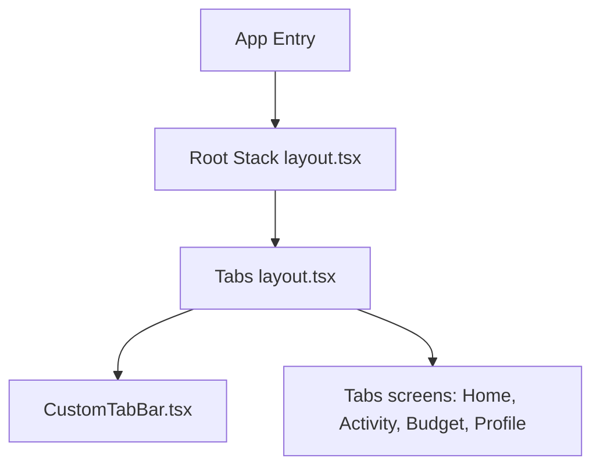

# Architecture Documentation

This document describes the high-level architecture of `MoneyApp`, a modern, polished personal finance application built using Expo, React Native, and TypeScript.

---

## 1. Directory Structure

The project follows a standard modular organization:

- **`src/app/`**: routing tree managed by Expo Router.
  - `_layout.tsx`: Root application container configuring global providers (`GestureHandlerRootView`, font preloading, status bar styling).
  - `(tabs)/_layout.tsx`: Tabs layout using Expo Router `<Tabs>` and mapping routes to screens using our animated floating custom tab bar.
  - `(tabs)/index.tsx`, `budget.tsx`, `profile.tsx`, `transactions.tsx`: Screen components.
- **`src/components/`**: Reusable UI components.
  - `CustomTabBar.tsx`: Custom bottom navigation bar incorporating sliding spring indicators, micro-interactions, haptic feedback, and platform safe-area contexts.
  - `GlassCard.tsx`, `CustomButton.tsx`, `AppText.tsx`: Core UI elements styled to match the theme.
- **`src/store/`**: Global state management powered by Zustand.
  - `themeStore.ts`: Tracks active theme mode (`light` or `dark`).
  - `authStore.ts`: Simple user authentication and initialization mock.
- **`src/hooks/`**: Custom React hooks.
  - `useTheme.ts`: Helper interface resolving colors and toggle methods.
  - `useCachedFonts.ts`: Asynchronously preloads Google Fonts (`Poppins`, `Inter`).
- **`src/constants/`**: Colors, dimensions, typography scale configurations.

---

## 2. Navigation Architecture

`MoneyApp` employs file-based routing:
1. **Root Stack**: Standard stack navigator transitioning between screens (header hidden). The first route is `(tabs)`.
2. **Bottom Tabs**: Replaces standard bottom tab bar with an animated custom component (`CustomTabBar`).

### Custom CustomTabBar Integration
Instead of rendering static tabs, the layout renders `CustomTabBar` which fetches safe area insets via `react-native-safe-area-context` to dynamically position itself at the bottom of the screen.

---

## 3. Component Details & Interactions

### CustomTabBar (`src/components/CustomTabBar.tsx`)
- **Glassmorphic Layout**: Blurs screen content on iOS using `expo-blur`. Fallback semi-transparent backgrounds are applied on Android.
- **Micro-Interactions**:
  - Unfocused tabs show only their respective icons.
  - Selecting a tab triggers a scale increase on the icon (`1.12x`), shifts it upward (`translateY: -8px`), and spring-fades its text label (`opacity: 1`, `translateY: 0`) from below.
- **High-Performance Animations**: Powered by `react-native-reanimated` running transitions directly on the native thread.
  - Horizontal translation of the active indicator uses `withSpring`.
- **Haptics**: Triggers selection feedback via `expo-haptics` to reassure user interactions.

---

## 4. Global State & Theme Integration

- Theme values (`LightTheme` and `DarkTheme` from `src/constants/themes.ts`) are hooked dynamically in UI components using the `useTheme` interface.
- Changing theme mode automatically triggers color updates within the custom tab bar (dynamic transition from lime neon indicators on light theme to soft glassmorphic indigo indicators on dark theme).
